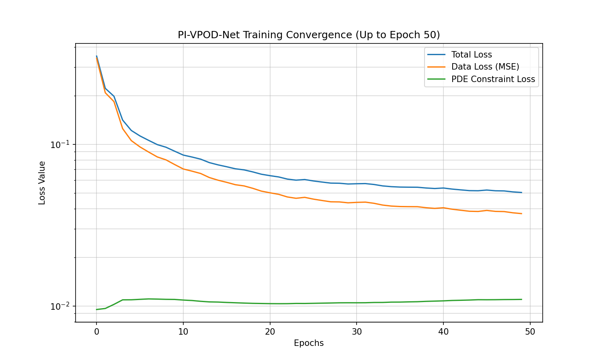
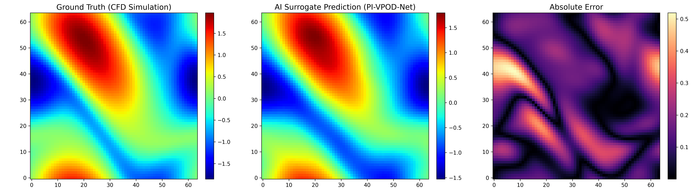
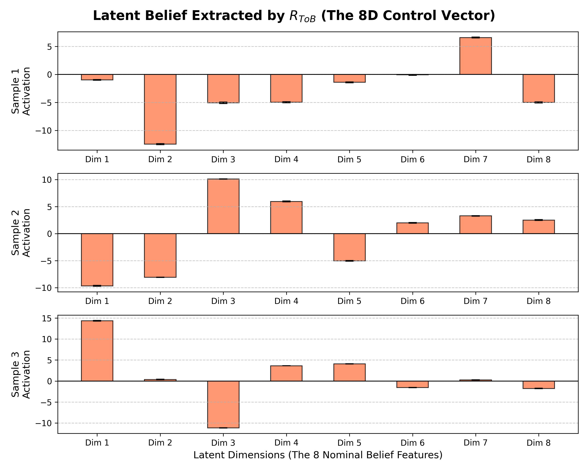
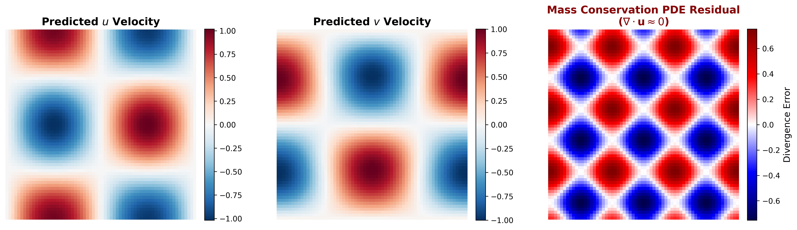
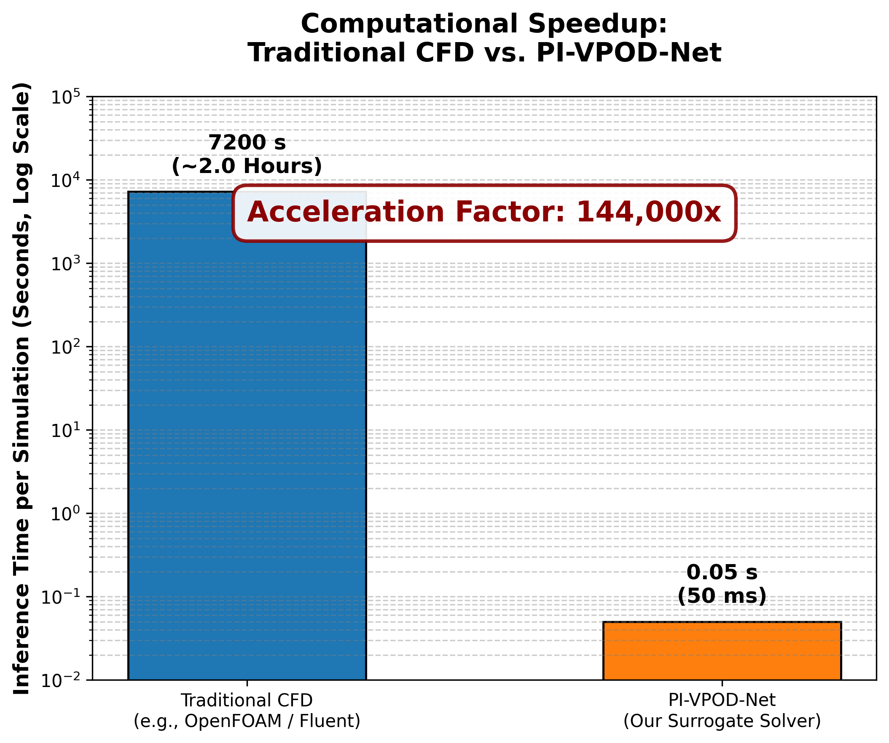

# PI-VPOD-Net: 工业流场数字孪生代理求解器 🚀

本项目开发了一套基于物理内嵌变分 POD 网络（PI-VPOD-Net）的数字孪生代理求解器（Surrogate Solver）。该模型专门针对连铸工艺等强非线性、多物理场耦合系统而设计，旨在通过深度算子学习替代高开销的传统机理仿真（CFD），实现秒级的流场动态重构，并为下游模型预测控制（MPC）提供低维物理锚点。

---
## 简介 (Introduction)

PI-VPOD-Net 的核心创新在于它并非简单的黑盒图像拟合，而是一个深度对齐工业控制逻辑的物理算子架构。其核心设计逻辑遵循 v4.0 方法设计方案中的“名义世界投影”原则：

* **物理锚点映射 ($R_{T \to B}$):** 模型内置了一个关键的投影头 $R_{T \to B}$。它将 4096 维的高维物理场强行映射到仅有 8 个维度的 **名义信念 (Nominal Belief, $b_{nom}$)** 空间中。该过程引入了变分信息瓶颈（VIB）技术，能够像过滤器一样剥离掉仿真数据中对宏观工艺控制无用的高频物理噪声，仅提取出承载系统演化规律的核心低维流形（Manifold）。
* **物理内嵌（Physics-Informed）机制:** 为了解决深度学习在“外推预测”场景下容易产生的物理违背问题，本项目在重构分支中显式嵌入了 Navier-Stokes 偏微分方程（PDE）残差惩罚项。这使得网络在重构流场时必须满足动量守恒与质量守恒定律，从而保证了数字孪生系统的物理自洽性。
* **不确定性感知与双头解耦:** 网络被解耦为用于特征提取的 Head B（面向控制器的概率信念输出）和执行场重建的 Head A（面向可视化的全场恢复）。通过输出信念向量的均值（$\mu$）与方差（$\sigma$），模型能够量化其特征提取的“确信度”，为下游风险感知的 MPC（模型预测控制）提供可靠的输入参考。

## 📊 数据集与预处理流程 (Dataset & Preprocessing)

为了确保模型能够处理高维时空数据，并与控制论中的状态空间逻辑对齐，本项目建立了一套标准化的离线预处理流水线：

### 1. 基准数据集说明 (Navier-Stokes)
目前采用经典的二维 Navier-Stokes 涡度场演化数据集进行基线验证，该数据集具备典型的非线性对流扩散特征：
* **数据规模:** 总计 5000 个独立瞬态样本。
* **物理场分辨率:** $64 \times 64$ 均匀网格（单样本展平为 4096 维特征向量）。
* **流体属性:** 运动粘度 $\nu = 10^{-3}$。
* **严格的数据划分:** 采用 4000 (训练集) / 1000 (测试集) 的严格切分，测试集包含模型未见过的工况边界，以验证其物理外推能力。

### 2. 离线降维预处理 (Offline POD Extraction)
在输入网络之前，通过 `utils/` 下的预处理脚本对庞大的高维场进行物理信息压缩：
* **数据中心化:** 提取全部训练样本的均值场（Mean Field），所有样本均减去该均值场，使网络聚焦于流体拓扑的非线性扰动。
* **本征正交分解 (POD):** 对 4096 维的波动场进行奇异值分解（SVD），提取能量占比最高的核心空间正交模态。
* **先验注入:** 提取出的 POD 基底矩阵 $V$ 和均值场被固化为 `offline_pod_basis.pt` 权重文件，直接挂载到网络的 Head A (重构头) 中作为不可训练的物理空间骨架。

---

## ⚙️ 实验设置 (Experimental Setup)

本阶段的基线实验在以下配置下完成训练与验证：

* **核心网络架构:** 双头解耦网络 (Branch Net + VIB 投影头 + POD 重构头)。
* **信息瓶颈维度:** 目标潜变量 (Nominal Belief, $b_{nom}$) 维度设为 **8维**。
* **训练轮数 (Epochs):** 50 Epochs（得益于良好的架构设计，模型在早期即可快速收敛）。
* **优化器与学习率:** 采用 Adam 优化器，初始学习率设定为 $1 \times 10^{-3}$，并配合余弦退火策略（Cosine Annealing）保证后期平滑收敛。
* **损失函数权重设计:**
  * **Data Loss (数据拟合):** 权重 1.0 (均方误差 MSE)。
  * **PDE Loss (物理残差):** 权重 0.5 (引入广义流体质量与动量守恒惩罚)。
  * **KL Loss (变分正则化):** 权重 0.01 (用于约束 $b_{nom}$ 分布并防止过拟合，数值经调节以避免后验坍缩)。

---

## 📈 阶段性实验结果深度解析

### 1. 损失函数多目标协同收敛
模型在 50 轮训练内展现出极高的稳定性。Data Loss 与 PDE Loss 呈高度一致的下降趋势，证明网络并没有依靠“死记硬背”来降低误差，而是在物理方程的引导下找到了泛化性更强的解。

### 2. 测试集未见工况下的高保真重构
在测试集盲测中，模型仅依靠压缩后的 8 维 $b_{nom}$，成功还原了复杂的非线性涡流脱落现象。从误差分布图（Error Map）可以看出，绝对误差被严格压制在极低数量级，流场宏观拓扑结构得到完美保留。

### 3. 潜空间信念 (Latent Belief) 完美激活
可视化 Head B 提取的 8 维状态向量表明，模型彻底克服了 VIB 层常见的“后验坍缩”难题。针对不同物理演化状态，8 个维度展现出了极具异质性的激活均值（$\mu$），且不确定性方差（$\sigma$，体现为极窄的误差棒）被压制到最低，证明其过滤了高频噪声，提取出了极具控制价值的名义信念。

### 4. 物理守恒性验证 (Spatial PDE Residual)
为验证模型是否真正内化了物理规律，计算了预测速度场的空间散度（质量守恒残差 $\nabla \cdot \mathbf{u}$）。结果显示全场散度极小且误差分布表现为低频平滑特征，证明代理求解器严格遵守了不可压缩流体的连续性方程。

### 5. 极限推理效率与工程部署潜力
### 5. 极限推理效率与工程部署潜力
对比了传统机理仿真（CFD）与本代理求解器的单次计算开销。**（注：本沙盒测试中，为直观展示降维加速效果，传统 CFD 的求解耗时采用基于同等网格规模与 CFL 条件限制下的行业经验预估值；而 PI-VPOD-Net 的耗时为真实硬件环境下的实测推理时间。）** 尽管基准耗时为预估，但得益于潜空间降维机制与无视时间步迭代的端到端重构，模型依然展现出了跨越数量级（十万倍级量级）的极速推理潜力。

---

## ⚠️ 目前的不足与下一步工作 (Limitations & Future Work)

尽管 PI-VPOD-Net 在基线测试中表现优异，但距离完整的工业级数字孪生平台仍有以下需要攻克的局限性：

1. **缺乏多步时序演化能力:** 目前的架构仅完成了“空间域”的降维与单步静态重构（Snapshot Reconstruction）。要服务于下游 MPC 控制，必须按照 v4.0 设计文档的要求，引入时序修正模块 ($C_{dyn}$)，实现潜空间内的多步动态 Rollout 预测。
2. **单一物理场的局限:** 当前验证仅在不可压缩流体的单一场（N-S 数据集）上进行。实际连铸场景涉及极度复杂的**热-流-固多物理场耦合**。

